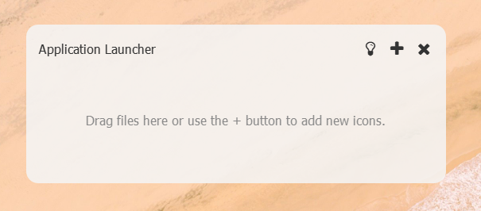
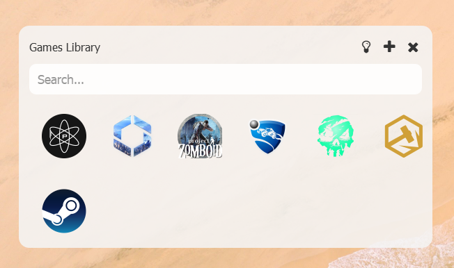
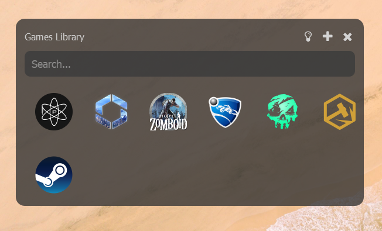
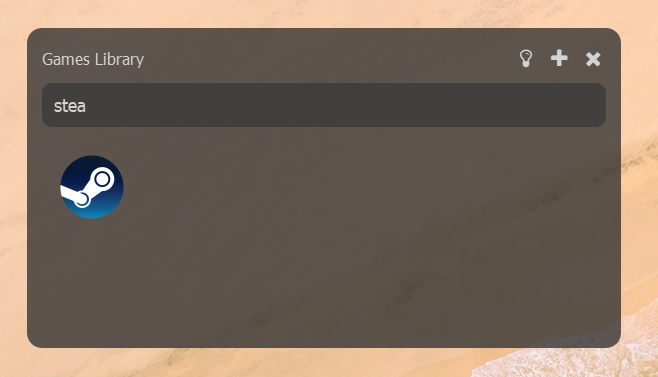

# FlexiLaunch

**FlexiLaunch** is a customizable application launcher that allows you to manage multiple independent instances, each with its own configuration. Whether you need a launcher for gaming, productivity, or system utilities, FlexiLaunch provides a flexible and user-friendly interface for managing all your applications in one place.

**Disclaimer**
Any third-party application references shown in the screenshots are for demonstration purposes only and do not imply endorsement or affiliation.

## Development Status

This project is currently just an example. There are many features still to be added.


## Screenshots



_Empty Instance_



_Light Theme_



_Dark Theme_



_Search_

## Features
- Multiple configurable instances with individual settings.
- Customizable titles and themes (dark/light mode).
- Drag-and-drop support for adding new applications.

## Installation
1. Clone the repository:
   ```bash
   git clone https://github.com/your-username/FlexiLaunch.git
   ```
2. Install the required dependencies:
   ```bash
   pip install -r requirements.txt
   ```

## Usage
1. Run the application:
   ```bash
   python flexilaunch.py
   ```
2. Configure each instance by adding applications, changing the theme, or modifying the settings in the local configuration files.

## Contributing
Contributions are welcome! Please submit pull requests or report issues to help improve FlexiLaunch.

## License
This project is licensed under the MIT License.
